### **Here are the controls to the Traffic Simulation Application:**

| Controls | Description |
| :-------: | :------: |
|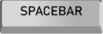| To Pause/Resume the simulation|
|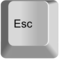| To exit the game|
|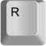| To randomly generate cars in the available tiles|
|| To view the next state/movement when paused|
|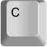| To clear all the cars |
|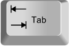| To clear all the road tiles in the simulation|
|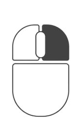| To Add/Remove a car on a road tile|
|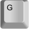  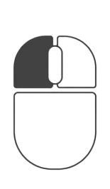| To add a green tile|
|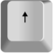  | To add up road tile|
|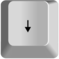  | To add down road tile|
|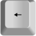  | To add left road tile|
|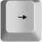  | To add right road tile|
