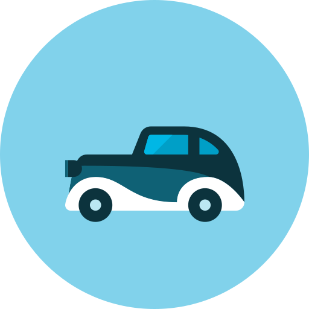
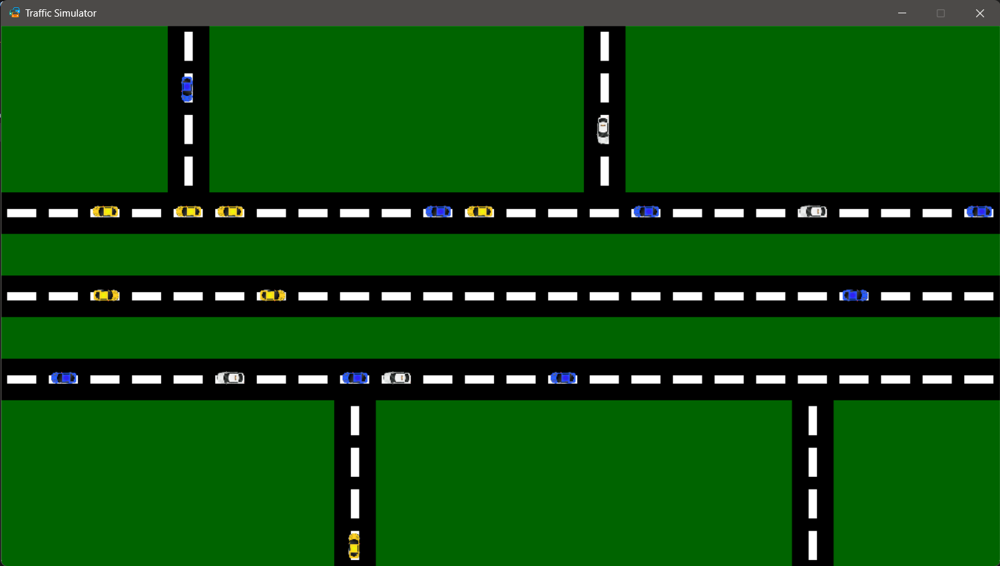

#  Traffic Simulation </img>
Traffic simulation is a simple game with python (pygame) that integrates system and discipline among cars in driving in traffic, with major probabilities of taking turns and switching roads whenever accessible.
This game not only does it automates the traffic but also can accept any kind of input from users: Deleting cars, adding cars, changing roads, ...etc.\
\

<h3><ins>Scientific Idea behind the App</ins></h3>

This game simply injects the idea of 1D Cell Automata where the idea is to consider a set of adjacent cells representing a street along which a car can move. The car jumps to its nearest neighbor cell unless this cell is already occupied by another car. Decelerate, if tailing distance to the next car is less than strength of pheromone suggests. Accelerate, if there is no pheromone or tailing distance is greater than suggested by pheromone strength. 
<b>The rule of motion can be expressed by:</b> 
$x(t+1)  =  x_{in} (t) (1-x(t)) + x_{out}(t).x(t)$  
where $x$ is the cell, $x_{in}$ is the cell from which the car come, $x_{out}$ the destination cell, and $t$ is time.

##  To directly play Traffic Simulation:
+ Download the [zipped folder](https://github.com/KatrineAshraf/Traffic-Simulation-With-User-Input/blob/789f902fd162384ca07d16db7d6886aac843f660/Traffic%20Simulation.zip) in my repository.
+ Extract the zip folder.
+ Run the `Traffic Simulation.exe` file.
>[!CAUTION]
> The executable file could mal-function if removed from the final extracted folder.

## To play from source code:
+ Clone the repository or download it and open it with any python interpreter.
+ `pip install pygame` or simply ignore if requirement is satisifed.
+ Run the `ui.py` file.

## The controls to the Traffic Simulation Application:
| Controls | Description |
| :-------: | :------: |
|| To Pause/Resume the simulation|
|| To exit the game|
|| To randomly generate cars in the available tiles|
|| To view the next state/movement when paused|
|| To clear all the cars |
|| To clear all the road tiles in the simulation|
|| To Add/Remove a car on a road tile|
|  | To add a green tile|
|  | To add up road tile|
|  | To add down road tile|
|  | To add left road tile|
|  | To add right road tile|

